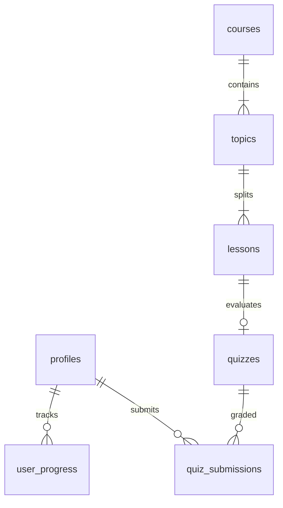

# Database Schema Specifications

This document defines the schema, table constraints, relationships, and Row Level Security (RLS) policies for the Supabase Postgres Database.

---

## 1. Entity-Relationship Diagram



---

## 2. Table Specifications

### 2.1 Profiles Table (`public.profiles`)
Keeps track of additional user metadata linked directly to Supabase Auth users.

* **Schema**:
  ```sql
  create table public.profiles (
    id uuid references auth.users on delete cascade primary key,
    email text not null,
    full_name text,
    avatar_url text,
    updated_at timestamp with time zone default timezone('utc'::text, now()) not null
  );
  ```
* **RLS Policies**:
  - `TO authenticated USING (auth.uid() = id)` for `SELECT`.
  - `TO authenticated USING (auth.uid() = id) WITH CHECK (auth.uid() = id)` for `UPDATE`.

---

### 2.2 Courses Table (`public.courses`)
Contains high-level course information. Maps to the top-level folders in `Courses/` (e.g. `Course-python` or `Course-ml-fundamentals`).

* **Schema**:
  ```sql
  create table public.courses (
    slug text primary key, -- e.g. 'Course-python'
    title text not null, -- e.g. 'Python Programming'
    description text not null,
    difficulty text check (difficulty in ('Beginner', 'Intermediate', 'Advanced')) not null,
    estimated_hours int not null,
    icon_name text not null,
    created_at timestamp with time zone default timezone('utc'::text, now()) not null
  );
  ```
* **RLS Policies**:
  - `TO authenticated, anon USING (true)` for `SELECT` (anyone can view courses).
  - Write access restricted to service role or authenticated admin users only.

---

### 2.3 Topics Table (`public.topics`)
Represents individual lesson pages or chapters. Maps directly to the subdirectories of a course in the filesystem (e.g., `01-Intro-to-Python`).

* **Schema**:
  ```sql
  create table public.topics (
    slug text primary key, -- e.g. '01-Intro-to-Python'
    course_slug text references public.courses(slug) on delete cascade not null,
    title text not null, -- e.g. 'What is Programming and Python?'
    description text,
    order_index int not null, -- e.g. 1 (extracted from folder prefix '01')
    unique(course_slug, order_index)
  );
  ```
* **RLS Policies**:
  - `TO authenticated, anon USING (true)` for `SELECT`.
  - Write access restricted to admin roles.

---

### 2.4 Lessons Table (`public.lessons`)
Represents the specific difficulty levels (Simple, Medium, Hard) within a topic's simulation panel. Each topic will have up to 3 simulation configurations.

* **Schema**:
  ```sql
  create table public.lessons (
    slug text primary key, -- e.g. '01-Intro-to-Python-simple'
    topic_slug text references public.topics(slug) on delete cascade not null,
    title text not null, -- e.g. 'Variables Assignment'
    content_path text not null, -- e.g. 'Courses/Course-python/01-Intro-to-Python/.tutorial/Tutorial.md'
    difficulty_level text check (difficulty_level in ('Simple', 'Medium', 'Hard')) not null,
    order_index int not null, -- 1 for Simple, 2 for Medium, 3 for Hard
    unique(topic_slug, order_index)
  );
  ```
* **RLS Policies**:
  - `TO authenticated, anon USING (true)` for `SELECT`.
  - Write access restricted to admin roles.

---

### 2.5 User Progress Table (`public.user_progress`)
Tracks which topics and lessons a student has completed.

* **Schema**:
  ```sql
  create table public.user_progress (
    id bigint generated always as identity primary key,
    user_id uuid references public.profiles(id) on delete cascade not null,
    course_slug text references public.courses(slug) on delete cascade not null,
    topic_slug text references public.topics(slug) on delete cascade not null,
    completed boolean default true not null,
    completed_at timestamp with time zone default timezone('utc'::text, now()) not null,
    unique(user_id, course_slug, topic_slug)
  );
  ```
* **RLS Policies**:
  - `TO authenticated USING (auth.uid() = user_id)` for `SELECT`.
  - `TO authenticated WITH CHECK (auth.uid() = user_id)` for `INSERT`.
  - `TO authenticated USING (auth.uid() = user_id) WITH CHECK (auth.uid() = user_id)` for `UPDATE` and `DELETE`.

---

### 2.6 Quizzes Table (`public.quizzes`)
Contains sets of multiple-choice questions or programming challenges evaluated at the end of each lesson.

* **Schema**:
  ```sql
  create table public.quizzes (
    id bigint generated always as identity primary key,
    lesson_slug text references public.lessons(slug) on delete cascade not null,
    questions jsonb not null, -- Array of objects: [{id: 1, type: "multiple-choice", question: "...", options: ["A", "B"], answer_index: 0}]
    passing_score int not null default 70
  );
  ```
* **RLS Policies**:
  - `TO authenticated USING (true)` for `SELECT`.
  - Write access restricted to admin roles.

---

### 2.7 Quiz Submissions Table (`public.quiz_submissions`)
Keeps logs of user quiz results and grades.

* **Schema**:
  ```sql
  create table public.quiz_submissions (
    id bigint generated always as identity primary key,
    user_id uuid references public.profiles(id) on delete cascade not null,
    quiz_id bigint references public.quizzes(id) on delete cascade not null,
    score int not null,
    passed boolean not null,
    submitted_at timestamp with time zone default timezone('utc'::text, now()) not null
  );
  ```
* **RLS Policies**:
  - `TO authenticated USING (auth.uid() = user_id)` for `SELECT`.
  - `TO authenticated WITH CHECK (auth.uid() = user_id)` for `INSERT`.

---

## 3. Migration Creation Flow

To implement these schemas in our Supabase local environment:

1. Create a migration file:
   `supabase migration new add_learning_schema`
2. Write the SQL schema, triggers, and RLS commands to the created file.
3. Validate by executing against the local database, or apply using CLI:
   `supabase db reset`
4. Confirm RLS is active on all tables.
