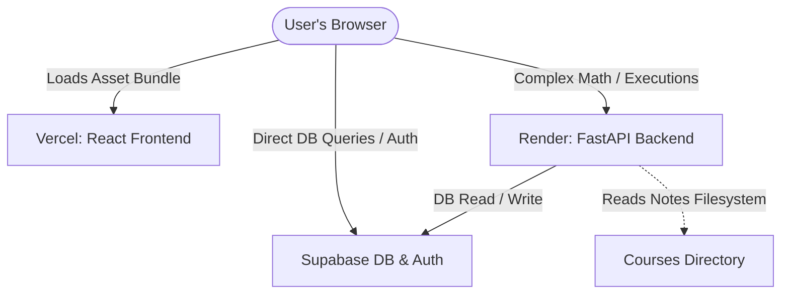

# System Architecture Specifications

This document defines the architecture, folder structure, routing, and deployment strategy for SimuLearn.

---

## 1. High-Level Architecture Overview

SimuLearn uses a modern decoupled architecture designed for high performance, interactivity, and security:



1. **Frontend (Vercel)**: React SPA built using Vite. It consumes the static notes content, renders interactive simulations (Framer Motion, React Flow, and Three.js), and communicates directly with Supabase Client for authentication, profile updates, progress tracking, and quizzes.
2. **Backend (Render)**: FastAPI app providing supplementary computational engines for ML/DL/LLM simulations (e.g., generating attention weights, stepping agent loops, running mock code snippets). It also runs the **Content Sync Engine** to parse the `Courses/` folder structure and sync it with Supabase.
3. **Database & Auth (Supabase)**: Relational database (PostgreSQL), authentication system, and Row Level Security (RLS) policies to secure progress tracking and quiz submissions.

---

## 2. Monorepo Directory Structure

The project is structured as a unified monorepo to make sharing database schemas, environment definitions, and course assets simple:

```text
SimuLearn/
├── .env                       # Shared local credentials (gitignored)
├── README.md                  # Project documentation
├── Courses/                   # Markdown files containing lesson notes (21 courses)
│   ├── Course-python/
│   │   ├── 01-Intro-to-Python/
│   │   │   ├── .tutorial/
│   │   │   │   └── Tutorial.md  # Raw Markdown notes
│   │   │   └── main.py          # Practice/sample code
│   │   └── ...
│   └── ...
├── frontend/                  # React Frontend Application
│   ├── package.json
│   ├── vite.config.js
│   ├── public/                # Static assets, images
│   └── src/
│       ├── main.jsx
│       ├── App.jsx
│       ├── index.css          # Global theme and CSS variables
│       ├── assets/            # Fonts, branding SVGs
│       ├── components/        # Reusable UI (Button, Card, Layout)
│       ├── context/           # React Contexts (AuthContext, ThemeContext)
│       ├── hooks/             # Custom hooks (useSupabase, useProgress)
│       ├── pages/             # Landing, Dashboard, CourseViewer, Quiz
│       └── simulations/       # Simulation logic and engines
│           ├── python/        # Python AST visualizer
│           ├── ml/            # ML interactive graphs
│           ├── dl/            # DL network backprop
│           ├── llm/           # Attention/token visualizers
│           └── agent/         # React Flow agent workflow editor
├── backend/                   # FastAPI Backend Application
│   ├── requirements.txt
│   ├── main.py                # Server entry point
│   ├── app/
│   │   ├── __init__.py
│   │   ├── config.py          # Settings and environment validation
│   │   ├── dependencies.py    # Auth verification dependencies
│   │   ├── routers/           # Endpoint controllers
│   │   │   ├── auth.py
│   │   │   ├── courses.py
│   │   │   ├── admin.py       # Sync triggers
│   │   │   └── simulation.py  # Simulation calculations
│   │   └── services/          # Business logic & algorithms
│   │       ├── sync_engine.py # Filesystem parser and Supabase writer
│   │       ├── code_exec.py   # Safe Python sandboxed run
│   │       ├── ml_engine.py   # Regression/Clustering calculations
│   │       └── agent_loop.py  # Step-by-step Agent ReAct runner
└── supabase/                  # Supabase Database Migration files
    ├── config.toml
    └── migrations/
        └── <timestamp>_init.sql
```

---

## 3. Routing Strategy

### Frontend Routes (React Router v6)

The client uses declarative routing configured via `BrowserRouter`:

| Path | Component | Auth Required | Description |
| :--- | :--- | :--- | :--- |
| `/` | `LandingPage` | No | Marketing website showcasing courses and live mini-simulations. |
| `/auth` | `AuthPage` | No | Unified Login, Signup, and Reset Password card layouts. |
| `/dashboard` | `Dashboard` | Yes | List of enrolled courses (21 phases), current progress, and recommendations. |
| `/courses/:course_slug` | `CourseOverview` | Yes | List of modules, chapters, and quizzes for a specific course. |
| `/courses/:course_slug/topics/:topic_slug` | `CourseViewer` | Yes | Split-screen notes (left) and interactive simulation panel (right). |
| `/courses/:course_slug/quizzes/:quiz_id` | `QuizPage` | Yes | Interactive multiple-choice / coding quizzes with instant feedback. |
| `/profile` | `ProfilePage` | Yes | User account settings, certificates achieved, and analytics. |

### Backend REST API Routes (FastAPI)

All backend endpoints are prefixed with `/api/v1` and handle stateless compute and content sync actions:

- **Admin/Sync**:
  - `POST /api/v1/admin/sync` - Scans the `Courses/` directory recursively, extracts titles, descriptions, paths, and upserts them to Supabase tables (`courses`, `topics`, `lessons`). Requires a `X-Admin-Secret` header or service role key verification.
- **Auth Validation**:
  - `GET /api/v1/auth/me` - Validates the Supabase JWT token passed in the `Authorization: Bearer <JWT>` header.
- **Python Execution Engine**:
  - `POST /api/v1/simulation/python/execute` - Runs user code in a secure sandboxed interpreter and returns the output variables and call stack history.
- **ML / DL Math Generators**:
  - `POST /api/v1/simulation/ml/fit` - Fits regression/clustering models with user parameters and returns prediction boundaries.
- **Agentic AI Runner**:
  - `POST /api/v1/simulation/agent/step` - Performs one step of a ReAct loop (Thought -> Action -> Observation) and returns the state for React Flow rendering.

---

## 4. Deployment Strategy

### Frontend Deployment (Vercel)
- The React build outputs to `frontend/dist/`.
- Deployed on **Vercel** with a `vercel.json` file configuring SPA routing fallback:
  ```json
  {
    "rewrites": [
      { "source": "/(.*)", "destination": "/index.html" }
    ]
  }
  ```

### Backend Deployment (Render)
- Deployed on **Render** as a Web Service.
- Run command: `uvicorn main:app --host 0.0.0.0 --port $PORT`
- Auto-deploys on push to the `main` branch when changes inside the `/backend` folder are detected.
- Note: Requires mounting the `Courses/` directory as a shared folder or packaging it with the backend build bundle so the sync engine has access to the notes filesystem.

### Database Deployment (Supabase Cloud)
- Migrations managed locally and pushed to the Supabase Cloud instance using the CLI:
  `supabase db push`
- Database tables, schema, triggers, and Row Level Security policies are managed within the versioned migration files in `/supabase/migrations`.

